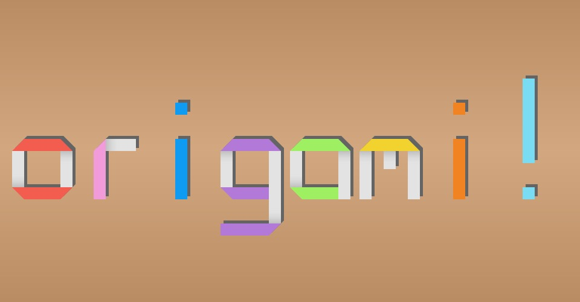

# MDDN 242 Project 2: Parametric Design
## Typeface Name: Origami
#### By Ivan Mangubat
### Part 1: Initial Ideas
To begin, we were tasked with drawing the letters "A", "B", and "C" in any style that we wanted, using parameters stored in an object. I initially aimed for a typeface that utilises bezier curves, so I crafted my parameters to adjust them accordingly:

- anchorOneX: the X value of the first anchor point
- anchorOneY: the Y value of the first anchor point
- anchorTwoX: the X value of the second anchor point
- anchorOneY: the Y value of the first anchor point
- controlOneX: the X value of the first control point
- controlOneY: the Y value of the first control point
- controlTwoX: the X value of the second control point
- controlTwoY: the Y value of the second control point

### Part 2: Design the Alphabet
This process was the most time-consuming, as now we had to redesign the letters A-Z, numbers 1-9, and a default character within the code framework. I had to change my idea from using bezier curves as I realised it would require more than 20 parameters to create the complicated characters using this approach.

Instead, I opted for a folded paper theme inspired by origami.  This idea allowed me to stay within the 20-parameter limit by creating custom "line" functions that form the strips of paper. A lot of calculations were involved in this function, but after they were all finalised the process of designing each character was very easy. These were the 20 parameters that defined each letterform:

- X1 - X4: the X value of the paper
- Y1 - Y4: the Y value of the paper
- W1 - W4 : the width of the paper
- H1 - H4: the height of the paper
- F1 - F4: the length of the folded section of the paper

After all the values were set, I added colour and shading to the characters for depth. The shadow is created using a similar custom function for the paper, and the subtle shading at the intersection of the edge of the paper and the folded section uses a *for* loop and a *lerpColor* function. I used the same method to set the background gradient, to simulate a tabletop.

One character that was limited by the number of parameters was the number 8, as it would require five sections of paper to create rounded corners on all sides. My current system only uses four sections of paper, and adding more would require more than 20 parameters, so I had to leave the unevenness of the corners as is to not be forced to recode my framework from the ground up.

### Part 3: Interpolation
Using the provided *interpolate_letter* function, we were now required to create visual transitions between letters when they are typed in exhibition mode. Using simple numbers as parameters for our letterforms made the calculations much easier through the use of the *map* function. The *percent* variable increments from 0 to 100 whenever a letter is typed, and this drives the animation of the interpolation. Using multiple *if* statements and a lot of math, I was able to construct five stages of animation each character goes through:

- 0% - 20%: the folded sections retract, while the paper is stationary
- 20% - 40%: the papers' width and height shrinks to 20x20, and moves to the centre space
- 40% - 60%: the papers are stationary
- 60% - 80%: the papers adjust to the new letterform parameters, apart from the folded sections which stay at 0
- 80% - 100%: the folded sections extend

### Part 4: Exhibition
The final part of this project was to refine our designs for exhibition mode, which allows for live typing of our typeface. I wanted each paper to have its own colour, so I included an array and made slight adjustments to the *exhibition.js* file to make this work.

Afterwards, I added ten words to the *swapWords* array, which is what the exhibition mode cycles through after inactivity. The words I have chosen relate to origami or art, with the added number string too. My full first name also fits the eight-character length and will be displayed last on the list.

### Citing External Influence
For this project, I only used ChatGPT to generate eight-letter words that relate to origami, paper or art to use for my *swapWords* list.

### Reflection
Within the constraints of the brief, this origami typeface is drawn using simple number parameters and mathematical interpolation. I am really satisfied with how it turned out, especially the animation between characters which is what I had envisioned when I first thought about the origami theme. I also appreciate the low-saturated one-sided colours of the paper, which reflects the sheets of origami in real life. Overall, this project was very fun to work on and will be an easy spectacle to share among family and friends.